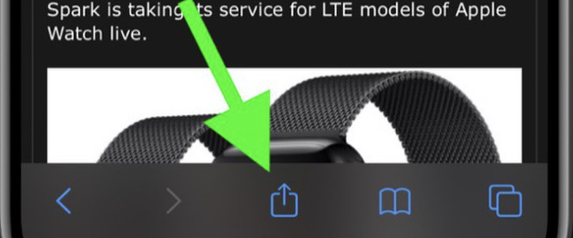
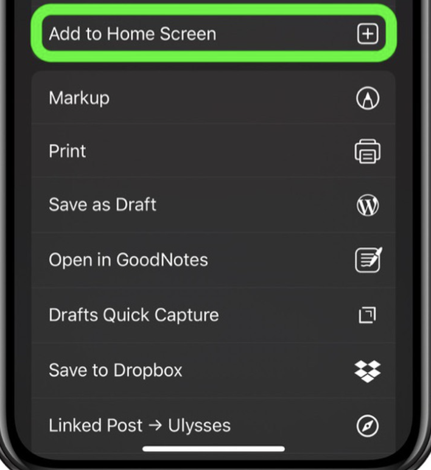

# First Responder Mobile App

## Project Summary
The First Responder Mobile app serves to assist emergency responders in connecting with medical experts and receiving appropriate medical expertise promptly, especially in rural areas where responders are essentially 'alone'. Emergency Responders connect to a Service Desk, where an attendee can see information about the situation, and page a relevant medical expert for assistance. The App is Powered by Amazon Chime, supporting video, audio, and text chat. In the case where data is not available, the app allows users to connect to Chime meetings via PSTN, over a toll-free number.

## Table of Contents
- [Dependencies](#dependencies)
- [Deployment](#Deployment)
- [Development Instructions](#development)
- [Installation](#installation)
- [Usage](#usage)

## Dependencies
- [Service Desk App](https://github.com/UBC-CIC/first-responder-admin) must be deployed to your AWS Account first.


## Deployment
- Assure all [dependencies](#dependencies) have been deployed into AWS account, then press the button below to deploy this app.

[](https://console.aws.amazon.com/amplify/home#/deploy?repo=https://github.com/UBC-CIC/first-responder-mobile-app)

## Development

### HTTPS
In order to use certain browser capabilities, like geolocation and user media (audio and video), a secure context (HTTPS) is required.
For local development, a trusted self-signed certificate is required to access HTTPS.

This repo provides self signed certificates, but it is recommended to create your own for security reasons.

[Generate a Self Signed Certificate](https://stackoverflow.com/questions/10175812/how-to-generate-a-self-signed-ssl-certificate-using-openssl)

> :warning: Make sure you trust these provided SSL Certificates
#### MacOS
  - Open the RootCA.crt in finder, and double click to open with Keychain Access. Open localhost.crt and double click.
  - This should have added 2 untrusted certs to the system keychain. For both: Right Click -> Get Info -> Trust -> When using this certificate: Always Trust
#### Windows
  - Follow instructions provided [here](https://docs.microsoft.com/en-us/skype-sdk/sdn/articles/installing-the-trusted-root-certificate)

#### Linux
  - ```cd certs```
  - ```apt-get install ca-certificates```
  - ```cp RootCA.pem /usr/share/ca-certificates```
  - ```sudo update-ca-certificates```

  Detailed Instructions [here](https://www.swiftstack.com/docs/admin/onpremise_management/self_signed.html)


### HTTP
- If you do not want to run the app with HTTPS, you can simply run the following command
> `npm run start-http`
## Installation
### iOS
- Open The app in Safari and press this button.
- Then add to your home screen by pressing this button

### Android
- Open the app on Chrome and press this button
- A prompt will ask you to install the app.
- Open the app from your phone's home screen.
## Usage **TODO**
See [User Guide](#)

## License
This project is distributed under the [MIT License](./LICENSE).
